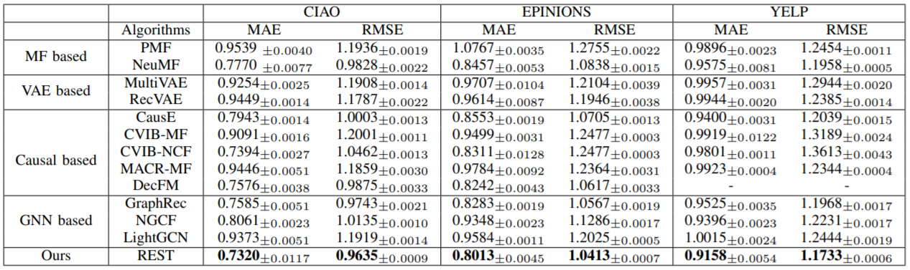

# REST

The PyTorch implementation of paper [REST: Debiased Social Recommendation via Reconstructing Exposure Strategies](xxx).

## Usage

### Download dataset

Download datasets: 
[Ciao](http://www.cse.msu.edu/~tangjili/datasetcode/ciao.zip), 
[Epinions](http://www.cse.msu.edu/~tangjili/datasetcode/epinions.zip), 
[Yelp](https://www.yelp.com/dataset/download)

Then unzip them into the directory `datasets` and run `preprocess_yelp.py`. 

```
└── datasets
    ├── Ciao
    │   ├── rating_with_timestamp.mat
    │   ├── trust.mat
    ├── Epinions
    │   ├── rating_with_timestamp.mat
    │   ├── trust.mat
    ├── Yelp
    │   ├── yelp_academic_dataset_review.json
    │   ├── yelp_academic_dataset_user.json
    │   ├── noiso_reid_u2uir.npz
    │   ├── ...
```

### Run

```bash
    python ./run_rate/run_rest_rate_ciao.py
```
During the training, we can obtain some logs and model-checkpoints in the directory `logs` and `saved_models`,

## Results


Detailed results can be found in the [paper](xxx).

